# Why this exists

A Quantity Surveyor answers the same two questions for the life of a project: **what will this
finally cost?** and **where are we drifting right now?** Both are usually answered in a
spreadsheet, at month-end, from numbers that are already several weeks old. By the time a cost
centre shows up as a problem, the money that caused the problem has been spent.

**QS Cost** is a working system built on the Tower X dataset that tries to move that moment
earlier. It does five things a spreadsheet does not:

1. It **computes** Earned Value Management (EVM) live, per cost centre, instead of storing a
   snapshot someone pasted in.
2. It **ranks** the cost centres that look fine today but are most likely to tip into trouble
   next period — and publishes the formula it used.
3. It **forecasts** next-period spend with a real uncertainty band, and reports how often that
   band was actually right.
4. It **attributes** an over-run to a resource category, and reconciles that attribution back
   to the exact AED so nothing is hidden in a rounding term.
5. It **puts all of it on the building** — a 3D model painted with cost performance, an IFC
   take-off priced with the project's own rate library, and a 4D playback of the build.

Alongside that it is a **system of record**: multi-project, multi-tenant, with reporting
periods you open and close, monthly capture forms, governed data administration, and a
plain-English assistant sitting over the top of it.

This document walks through all **19 implemented features**, one at a time. Each entry says
what question it answers, why a QS would care, how it works, what you see on screen, a real
worked example from Tower X, the API behind it, and — importantly — **what is validated and
what is not**.

> Everything described here is built and running. Nothing in this guide is a roadmap item.

---

**A note on honesty.** This system was built to a rule: never show a number the data cannot
support. Where a figure is directional rather than validated, the application says so on the
screen, and so does this document. The full list is in *The honesty ledger* at the back — it is
worth reading before you rely on any single figure.

# Earned Value Management in 60 seconds

Every feature in this guide rests on five numbers. If you already speak EVM, skip this page.

| Term | Full name | What it actually is |
|---|---|---|
| **BAC** | Budget at Completion | The cost budget for the scope. Not the sell price — margin and contingency are stripped out. |
| **PV** | Planned Value | What you *planned* to have earned by now. |
| **EV** | Earned Value | What you have actually earned — physical progress valued at budget rates. |
| **AC** | Actual Cost | What you have actually spent to get there. |
| **EAC** | Estimate at Completion | The forecast of final cost. |

From those, four derived measures do all the work:

| Measure | Formula | Reading it |
|---|---|---|
| **CV** — Cost Variance | EV − AC | Negative means you spent more than you earned. |
| **CPI** — Cost Performance Index | EV ÷ AC | Below 1.00 means every dirham buys less than budgeted. |
| **SV / SPI** — Schedule Variance / Index | EV − PV / EV ÷ PV | Below 1.00 means you are behind the plan. |
| **VAC** — Variance at Completion | BAC − EAC | Negative means the job is forecast to overspend. |

**The AMBER line.** In the Tower X data a cost centre is flagged **AMBER** exactly when its
**CPI drops below 0.95**. That threshold is not something this system invented — it is the
project's own rule, and it matches the supplied `Alert_Level` column on every single row with
zero mismatches. Everything in *Part B* of this guide is about seeing a centre cross that line
**before** it crosses it.

**One rule that matters more than it looks.** A project-level CPI is always
`sum(EV) ÷ sum(AC)` — never the average of the per-centre CPIs. Averaging ratios lets a tiny
cost centre with a terrible CPI drag the whole project's number around. Every roll-up in this
system aggregates the money first and divides once.

**Units.** All amounts are in **AED**. A "shift" in the estimate is **10 working hours**.

# The data behind it

Everything runs on one workbook: `data/Tower_X_Project_Data.xlsx`.

| Sheet | Rows | One row is… |
|---|---|---|
| `1_BOQ` | ~232 | A priced work item — one line of the bill of quantities. |
| `2_ESTIMATE_NORMS` | ~211 | An estimating "recipe": output rate and resource consumption per unit of work. |
| `3_BOQ_MAPPING` | ~194 | The link from a BOQ line to a norm to an estimate package. |
| `4_ESTIMATE_DATASHEET` | ~794 | A BOQ item exploded into its resource lines. **Unit rates live here.** |
| `9_HISTORICAL_DATA` | 2,076 | One cost centre in one reporting period. |

`9_HISTORICAL_DATA` is the spine: **173 cost centres × 12 monthly periods**, October 2025 to
September 2026. It carries actual progress, earned value, actual cost split four ways
(manpower / material / equipment / subcontract), and the project's own alert and risk flags.

Two things about this dataset shape the whole system:

**1. The computed sheets were deliberately withheld.** The project's budget, earned-value, KPI
and progress sheets are *not* in the workbook. Any EVM figure this system shows for Tower X had
to be **derived** from sheets 1–4 and 9, not looked up. That is why the dashboard talks about
"computed EVM" — it genuinely is.

**2. The estimate has a divisor that is easy to miss.** Manpower and equipment quantities in
`4_ESTIMATE_DATASHEET` are `BOQ quantity × (gang or equipment count ÷ Output Norm)` — **not**
`BOQ quantity × gang size`. Drop the Output Norm divisor and every labour and equipment cost is
overstated, the estimate stops reconciling, and the stress test in *Feature 10* would flag
almost everything. That divisor is load-bearing throughout.

## Tower X at a glance

Read from the workbook at period 12 (September 2026):

| | |
|---|---|
| Budget at completion (BAC) | **224,322,886 AED** |
| Cost centres | **173** — across 18 disciplines and 10 zones |
| Reporting periods | **12** (Oct 2025 → Sep 2026) |
| Panel rows | **2,076** |
| GREEN → AMBER transitions in the history | **117** |
| Median centre progress at period 12 | **13%** |

That last row explains a design decision you will meet repeatedly: with a median centre only
13% complete and just a handful finished, **there is no reliable final-cost ground truth in
this data**. So the forecaster in *Feature 7* forecasts *incremental* spend — which can be
back-tested — and treats final cost as directional. That is a deliberate limitation, not an
omission.

# How the system is put together

Four layers, each doing one job.

| Layer | What it is | What it does |
|---|---|---|
| **Store** | PostgreSQL 15, raw SQL schema | Holds every project's data, one tenant per project, isolated by row-level security. EVM identities are computed by a database view, not by application code. |
| **Analytics** | C# `Core` library | The risk scorer, the spend forecaster, the estimate stress tester, the variance attributor, the take-off pricer. All deterministic, all unit-tested. |
| **API** | ASP.NET Core 8 | 39 endpoints across 13 controllers. Every read of project data is authorised before it runs. |
| **Interface** | React 18 + Vite single-page app | 14 tabs, a 3D viewer, and a Copilot that calls the *same* analytics through read-only tools. |

Two properties are worth calling out because they are unusual:

**The analytics have no ML dependency.** Ridge regression, conformal prediction intervals,
quantile computation and the Cholesky solve are all hand-written in C#. There is no Python at
build time or run time. That means the numbers on the screen come from code you can read, and
the same code runs in the API, in the tests and behind the Copilot.

**The Copilot cannot invent a number.** It has no access to the database. It calls the same
13 read-only tools the dashboard uses, and those tools do the arithmetic. The language model's
job is to choose the tool and narrate the result — a boundary described in *Feature 11*.

# The features at a glance

| # | Feature | The question it answers |
|---|---|---|
| | **Where the project stands** | |
| 1 | Live EVM Dashboard | What is the project's cost health right now? |
| 2 | Cost Centre Grid & Detail | Which centres are in trouble, and what is going on inside one? |
| | **See trouble early** | |
| 3 | Early-Warning Watchlist | Which centres that still look fine are about to tip? |
| 4 | Variance Attribution Bridge | Where is this centre's over-run coming from? |
| 5 | Proof — hindsight back-test | Would this have actually worked last month? |
| 6 | Model Validation Panel | How accurate is the early-warning model, honestly? |
| | **Look forward** | |
| 7 | Cost-Trajectory Forecaster | How much will we spend next period, and what's the range? |
| 8 | Unit-Rate What-If | What happens if we renegotiate the rate? |
| 9 | Correction Actions | What could we do about it, and what would it be worth? |
| | **Before you award** | |
| 10 | Estimate Assumption Stress Test | Which estimate assumptions look aggressive — before we commit? |
| | **Ask it in plain English** | |
| 11 | QS Copilot | Anything above, asked as a question, answered with its evidence. |
| | **On the building** | |
| 12 | 3D Cost X-Ray | Where in the building is the money, and where is it drifting? |
| 13 | IFC Take-off | What would this model cost at our rates? |
| 14 | IFC → BOQ Element Register | Click an element — what does the bill say about it? |
| 15 | 4D Build Sequence | Play the build, coloured by cost performance. |
| | **Run it as a system** | |
| 16 | Reporting Workflow | How do we open and close periods and capture progress and cost? |
| 17 | Project Management | Create, import, switch and delete projects. |
| 18 | Data Administration | Governed editing of the underlying tables. |
| 19 | Multi-Tenant Security | How is each project's data kept separate? |

# 1 · Live EVM Dashboard

**Where the project stands**

> *What is the project's cost health right now?*

**Why a QS cares**

This is the screen you open first. It replaces the summary tab of the monthly report — except
the figures are computed the moment you ask for them, against whatever has been captured, for
whichever period you select. There is no "as at" caveat and no stale paste.

**How it works**

The API reads the project's cost centres for the selected period from Postgres and rolls them
up. The EVM identities are computed in a database view, so the dashboard, the analytics and the
Copilot all read the *same* arithmetic — they cannot disagree.

The project CPI is `Σ EV ÷ Σ AC` and the project SPI is `Σ EV ÷ Σ PV`; the trend charts plot
those two ratios across every period against the 1.00 target line, so a slow slide shows up as
a slope rather than a single bad month.

**What you see**

The **EVM Overview** tab: eight headline tiles (BAC, EV, AC, CPI, SPI, EAC, VAC, budget
consumed), then CPI and SPI trend sparklines across all 12 periods. A period selector in the
header changes every tab at once.

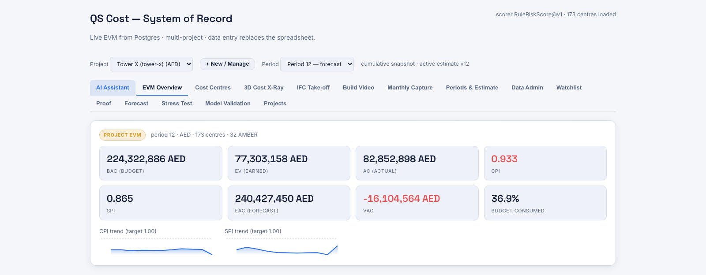

**On Tower X**

At period 12 the live instance shows a **224,322,886 AED** budget against **82,852,898 AED**
spent — 36.9% of budget consumed — for **77,303,158 AED** earned. That gives a project
**CPI of 0.933** and an **SPI of 0.865**: the project is both spending faster than it is
earning and running behind its own plan. The forecast at completion is **240,427,450 AED**,
a **−16,104,564 AED** variance against budget, with **32 of 173 centres** flagged AMBER.

**API**

| Endpoint | Purpose |
|---|---|
| `GET /api/v1/overview?period={p}` | Project EVM totals plus the full period-by-period trend. |
| `GET /api/v1/cost-centres?period={p}` | Per-centre computed EVM for the period. |
| `GET /api/v1/health` | Global process health — row and centre counts, scorer version. Not project data. |

**What's validated, what isn't**

- **Derived, not looked up.** Every figure on this screen is computed from the stored panel.
  The workbook's own computed EVM sheets were withheld, so there is nothing to copy from.
- **Read-only.** The dashboard never writes. Changes come through *Feature 16*.
- **EAC on this screen is the classic `BAC × AC ÷ EV` identity** — useful as a scale, but see
  *Feature 7* for why final cost is treated as directional on this dataset.

# 2 · Cost Centre Grid and Detail Drawer

**Where the project stands**

> *Which centres are in trouble, and what is going on inside one?*

**Why a QS cares**

The overview tells you the project has a problem. This tells you which of 173 cost centres owns
it. It is the working list — sortable, filterable, and one click from the detail of any line.

**How it works**

The same computed EVM as the overview, but per centre rather than rolled up. Every column is
sortable; a status filter narrows to GREEN, AMBER, NOT STARTED or CLOSED; a text filter matches
on the cost centre code. Clicking a row opens a drawer with that centre's full picture:
budget, planned and actual percent complete, budget consumed, PV / EV / AC, EAC, and its
lifecycle state.

The drawer also carries two AI-assisted panels — *"What's driving the drift"* (a narrative from
the Copilot, grounded in the same tools) and *"Correction actions"*, described in *Feature 9*.

**What you see**

The **Cost Centres** tab. Columns: cost centre, discipline, status, BAC, plan %, actual %, EV,
AC, CPI, SPI, EAC.

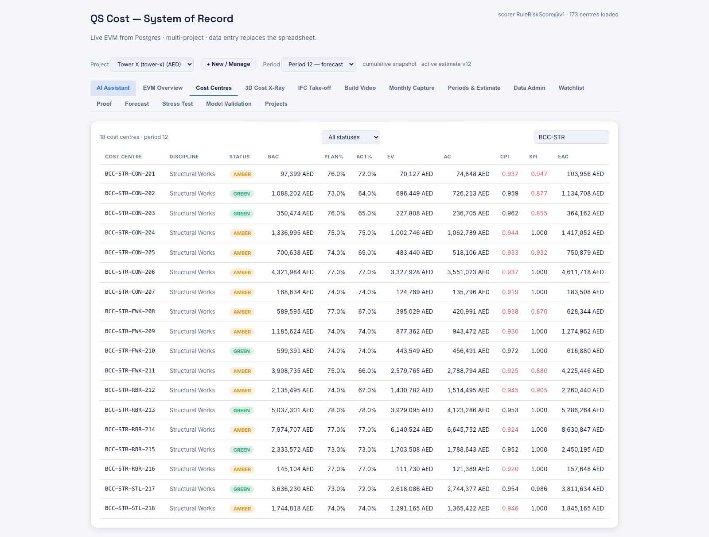

**On Tower X**

Filtering to `BCC-STR` returns the **18 structural cost centres**. `BCC-STR-CON-206` is the
largest at **4,321,984 AED** budget: 77% planned, 77% actual — dead on programme, SPI 1.000 —
but **CPI 0.937**, having spent 3,551,023 AED to earn 3,327,928 AED. This is the pattern the
early-warning work exists to catch: *the schedule looks perfect and the money does not*.

**API**

| Endpoint | Purpose |
|---|---|
| `GET /api/v1/cost-centres?period={p}` | The grid. |
| `GET /api/v1/variance?bcc={id}&period={p}` | The attribution shown in the drawer (see *Feature 4*). |

**What's validated, what isn't**

- The grid is a direct read of computed EVM — no modelling, no assumptions.
- The two AI panels in the drawer are clearly marked as such, and the arithmetic behind the
  correction chart is done in the front end, not by the model (*Feature 9*).

# 3 · Early-Warning Watchlist

**See trouble early**

> *Of everything that still looks fine, where should I look first?*

**Why a QS cares**

This is the core promise of the system. An AMBER cost centre is a problem you already have. A
GREEN cost centre that will be AMBER next month is a problem you can still do something about —
the money has not been spent yet. The watchlist is a short, ranked triage list of exactly those.

**How it works**

Only centres that are **GREEN in the current period** are scored — you cannot warn about
something already flagged. Each one gets a transparent, frozen score called
**`RuleRiskScore@v1`**, built from two signals:

**The gap.** How far ahead of physical progress the spending is:
`gap = % of budget consumed − % actually complete`, in percentage points. A centre that has
spent 60% of its budget to deliver 45% of the work has a gap of +15pp.

**Proximity to the line.** How close the CPI already sits to the 0.95 AMBER threshold,
measured *from above* — this term peaks exactly at 0.95 and decays as CPI rises.

The score is `0.7 × gap term + 0.3 × proximity term`, both terms clamped to 0–1. Only two
constants are fitted (the gap threshold and its scale), and they are fitted **strictly on
training periods** — never on the periods the score is judged against. Each row also carries up
to three plain-English reason codes explaining why it was flagged.

**What you see**

The **Watchlist** tab: rank, cost centre, discipline, risk score, current CPI, the budget /
progress gap in percentage points, and the reason chips. Clicking a row opens the variance
attribution drawer (*Feature 4*).

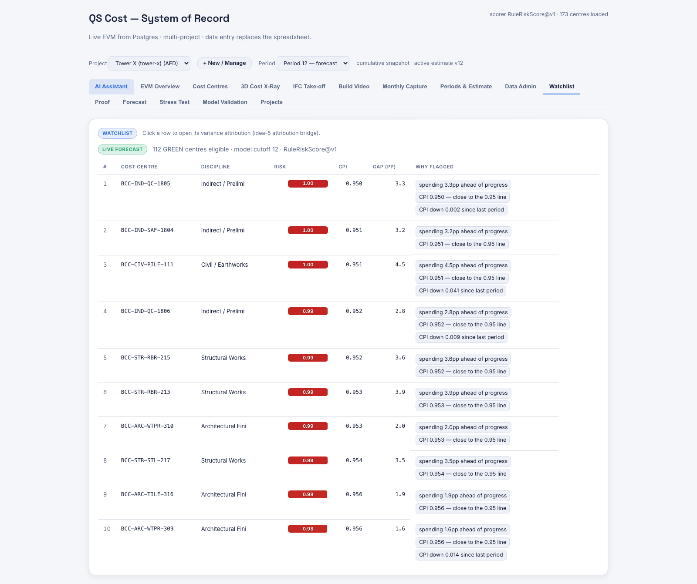

**On Tower X**

At period 12, **112 GREEN centres** are eligible. The top-ranked is `BCC-IND-QC-1805` at risk
**1.00**: CPI **0.950** — sitting exactly on the line — spending **3.3pp** ahead of progress,
and CPI down 0.002 since last period. Third is `BCC-CIV-PILE-111`, whose CPI fell **0.041** in
a single month, the sharpest recent drop on the list.

The history bears the pattern out. Of the centres GREEN at period 11, **10 tipped to AMBER at
period 12**. The largest was `BCC-STR-FWK-209` — 1,185,624 AED of budget, GREEN at CPI 0.957
while spending 2.7pp ahead of progress, then AMBER at CPI 0.930 with a **−66,110 AED** cost
variance. That is one month of warning on a 66,000-dirham swing, on one centre.

**API**

| Endpoint | Purpose |
|---|---|
| `GET /api/v1/watchlist?period={p}&k={5\|10}` | Ranked GREEN-about-to-tip centres. |

`403` if you are not a member of the project, `404` for an unknown project or a period with no
model artifact, `400` for a malformed period or k.

**What's validated, what isn't**

- **Transparent, not a black box.** The score is a published two-term formula with two fitted
  constants. Anyone can recompute it by hand from the grid.
- **No leakage.** Each period is scored by a model trained strictly on its own past. The
  measured accuracy is in *Feature 6*, and *Feature 5* lets you watch it happen.
- **Single-project evidence.** Everything here is validated on the Tower X workbook. No claim
  is made that the constants transfer to another project.

# 4 · Variance Attribution Bridge

**See trouble early**

> *Where is this centre's over-run actually coming from?*

**Why a QS cares**

Knowing a centre is 33,000 AED over is the start of a conversation, not the end of one. The
next question is always *which resource* — is this a labour productivity problem, a materials
price problem, or a subcontractor who has not invoiced yet? Those have completely different
responses.

**How it works**

The bridge splits the cost variance `CV = EV − AC` across the four resource categories —
manpower, material, equipment, subcontract — and reports the schedule variance `SV = EV − PV`
in a **separate lane**, because mixing cost and schedule into one waterfall is how attribution
goes wrong.

For each resource, the estimate's own resource mix gives a share of earned value:
`EV_r = EV × share_r`. The actual cost split `AC_r` comes from the recorded actuals. The
resource's contribution is `CV_r = EV_r − AC_r`, and the ratio `AC_r ÷ EV_r` — shown as
"×norm" — says how many times its norm-implied budget that resource actually consumed.

**The tie-out is the point.** The panel asserts, to the dirham, that
`Σ CV_r + unexplained residual = CV`. If the four recorded splits do not add up to the total
actual cost, the difference appears as a visible residual line — it is never absorbed into one
of the four categories to make the picture tidy.

**What you see**

A drawer opened by clicking a watchlist or cost-centre row: a headline sentence naming the
dominant contributor, PV / EV / AC / CV tiles, a waterfall chart, the per-resource table, and
the tie-out statement.

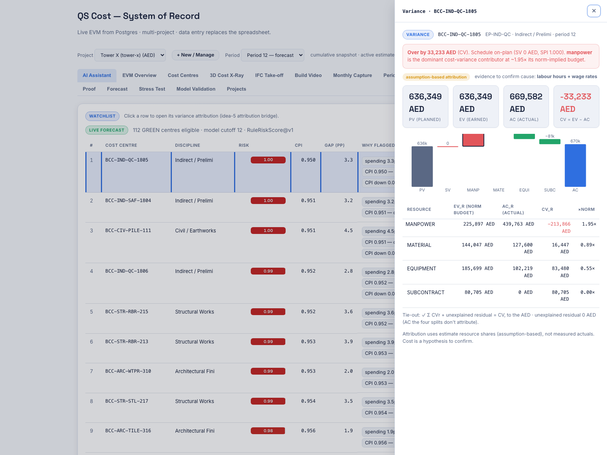

**On Tower X**

`BCC-IND-QC-1805` at period 12 is **over by 33,233 AED**, and its schedule is clean —
SV 0 AED, SPI 1.000. The split is unambiguous:

| Resource | EV (norm budget) | AC (actual) | CV | ×norm |
|---|---|---|---|---|
| Manpower | 225,897 AED | 439,763 AED | **−213,866 AED** | **1.95×** |
| Material | 144,047 AED | 127,600 AED | +16,447 AED | 0.89× |
| Equipment | 185,699 AED | 102,219 AED | +83,480 AED | 0.55× |
| Subcontract | 80,705 AED | 0 AED | +80,705 AED | 0.00× |

Unexplained residual: **0 AED**. Manpower consumed nearly twice its norm-implied budget while
everything else under-ran; the other three categories are masking a labour problem roughly six
times the size of the headline number. The panel names manpower as the dominant contributor and
states the evidence a QS would need to confirm it: **labour hours and wage rates**.

**API**

| Endpoint | Purpose |
|---|---|
| `GET /api/v1/variance?bcc={id}&period={p}` | Attribution, schedule lane, and tie-out. |

**What's validated, what isn't**

- **The tie-out is exact and asserted by tests.** `Σ CV_r + residual = CV` holds to the dirham
  or the build fails.
- **The attribution is assumption-based, and says so on screen.** The earned-value split uses
  the *estimate's* resource shares, not measured actuals per resource — the data does not carry
  earned value split by resource. The panel is badged "assumption-based attribution" and names
  the evidence needed to confirm it. **It is a hypothesis to test, not a proven cause.**
- Only live packages with a finite PV / EV / AC and EV greater than zero are attributed.

# 5 · Proof — the hindsight back-test

**See trouble early**

> *Would this have actually worked last month?*

**Why a QS cares**

Any tool can produce a ranked list. The question that decides whether you trust it is whether
the list was right last time. This tab answers that by letting you rewind.

**How it works**

You pick a past period. The system re-scores that period using a model that saw **only the
history up to that point** — no future data, no refitting on the answer — and shows you the
watchlist it *would* have produced. Then it reveals what actually happened in the following
period and grades each row: did that centre really tip?

Because the model artifacts are built with a rolling origin, the model used for period 5 is a
genuinely different, earlier model than the one used for period 11. The rewind is not a replay
of today's model against old data.

**What you see**

The **Proof** tab: a period rewind selector, the flagged rows with their reason codes, a hidden
"actual next period" column, and a **Reveal what happened** button. A headline compares the
rule's precision against the best simple CPI rule.

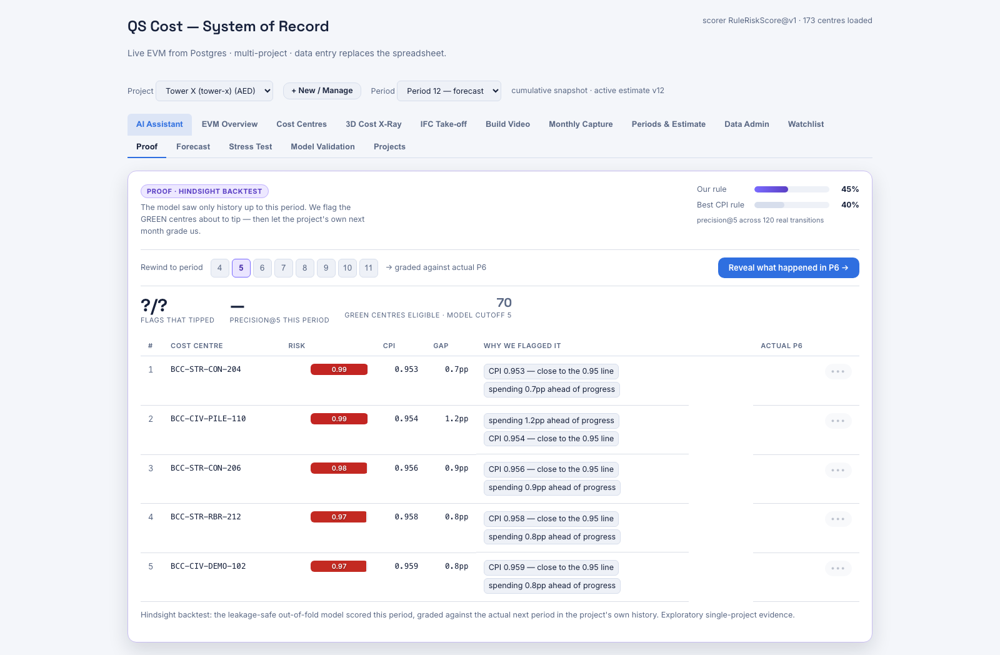

**On Tower X**

Rewind to period 5 and the model — knowing only periods 1 to 5 — flags `BCC-STR-CON-204`
(CPI 0.953, 0.7pp ahead of progress), `BCC-CIV-PILE-110` (CPI 0.954, 1.2pp),
`BCC-STR-CON-206`, `BCC-STR-RBR-212` and `BCC-CIV-DEMO-102`, out of **70 eligible GREEN
centres**. The answer for period 6 sits behind the reveal button.

Across the whole rewindable range the header reports the rule at **45% precision@5** against
**40%** for the best simple CPI rule, over 120 real transitions.

**API**

| Endpoint | Purpose |
|---|---|
| `GET /api/v1/watchlist/backtest?period={p}&k={5\|10}` | The hindsight-graded watchlist for that origin. |

**What's validated, what isn't**

- **Leakage-safe by construction.** The out-of-fold model for each origin is trained only on
  strictly earlier periods, and each fold's artifact carries a fingerprint of the exact training
  data used.
- **Exploratory, single-project evidence.** Per-period precision on a handful of flags is a
  noisy statistic. The tab labels itself as exploratory; *Feature 6* is where the aggregate
  numbers and their spread live.

# 6 · Model Validation Panel

**See trouble early**

> *How accurate is the early-warning model, honestly?*

**Why a QS cares**

Because the honest answer to "how good is it?" is usually buried in a slide nobody wrote. This
tab is the system grading itself in public, including the results that did not go its way.

**How it works**

The panel reports a rolling-origin evaluation of the deployed rule against three **CPI-native
baselines** — plain CPI, the one-period change in CPI, and a rolling 3-month CPI. All four score
the same eligible rows on the same folds, so the comparison is like-for-like. `precision@5`
means: of the five centres flagged, how many actually tipped.

It also publishes two experiments that are explicitly *not* promotions.

**What you see**

The **Model Validation** tab: headline metrics, the rule-versus-baselines table, a
per-fold breakdown, and two panels of published negative and descriptive results.

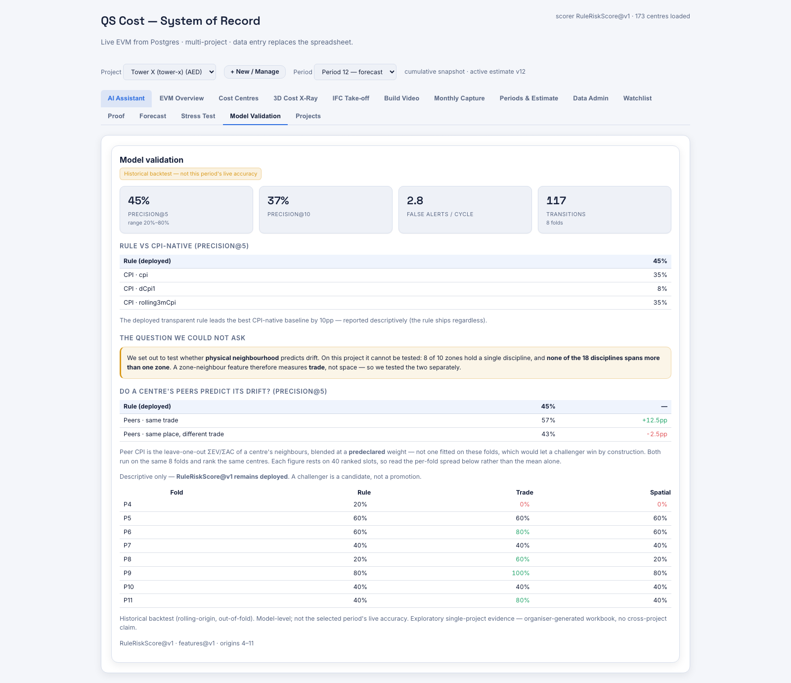

**On Tower X**

| Metric | Value |
|---|---|
| precision@5 | **45%** (per-fold range 20%–80%) |
| precision@10 | 37% |
| False alerts per cycle | 2.8 |
| Transitions evaluated | **117**, across 8 folds |

Against the baselines: rule **45%**, plain CPI 35%, rolling-3-month CPI 35%, change-in-CPI 8%.
The deployed rule leads the best CPI-native baseline by **10 percentage points** — reported
descriptively; the rule ships regardless of whether it wins on a given fold.

**The question we could not ask.** The original hypothesis was that *physical neighbourhood*
predicts drift — that a cost centre next to a struggling one is itself at risk. On Tower X that
cannot be tested: **8 of 10 zones hold a single discipline, and none of the 18 disciplines spans
more than one zone**. A "zone neighbour" feature would therefore be measuring *trade*, not
space. Rather than quietly ship a spatial feature that is really a trade feature, the system
separated the two and published the finding.

**Do a centre's peers predict its drift?** Tested separately: same-trade peers score **57%**
(+12.5pp on the rule), same-place-different-trade peers **43%** (−2.5pp). The peer blend weight
is **predeclared, never fitted on these folds** — fitting it would let a challenger win by
construction. Both are marked descriptive only; **`RuleRiskScore@v1` remains deployed**. A
challenger is a candidate, not a promotion.

**API**

| Endpoint | Purpose |
|---|---|
| `GET /api/v1/validation-summary` | The frozen model-level back-test. Global and unauthenticated — it reports the process's startup Tower X model, not your selected project. |

**What's validated, what isn't**

- These are **historical back-test** figures, not this period's live accuracy — the tab says so
  in a badge.
- The per-fold range (20%–80%) is published alongside the mean precisely because the mean alone
  would overstate how settled the number is.
- Single project. 117 transitions is enough to compare rules against each other and not enough
  to claim a universal benchmark.

# 7 · Cost-Trajectory Forecaster

**Look forward**

> *How much will we spend next period, and what is the realistic range?*

**Why a QS cares**

A single-point forecast is a number you will be held to and cannot defend. A band with a stated
confidence — and a published record of how often that band was actually right — is something
you can put in a report.

**How it works**

The forecaster deliberately predicts **incremental spend over the next one, two and three
periods** rather than final cost. That is the reframe that makes the whole feature honest: with
a median centre 13% complete, this dataset simply contains no reliable final-cost outcomes to
learn from — but it contains 12 periods of real month-on-month spend, which *can* be tested.

**The central estimate (P50)** comes from a ridge regression working in *BAC-fraction* space —
it predicts the next period's spend as a proportion of the centre's budget, so small and large
centres are learned on the same scale. Six features drive it: planned spend at the target
period, the most recent increment, the previous increment, rolling CPI, progress fraction, and
run rate. Missing values are imputed and flagged rather than dropped.

**The band (P10–P90)** is not a modelling assumption — it is **split-conformal**. The model's
out-of-fold errors on centres it never trained on are collected, bucketed by how far along the
centre is, and the empirical 10th and 90th percentiles of those real errors become the band. If
there are not enough calibration residuals, the system says the interval is unavailable rather
than widening a guess.

**The cone** across all three horizons is produced by simulating joint residual *paths*, never
by adding endpoints — errors at h=1 and h=2 are correlated, and treating them as independent
would understate the spread. A project-level scenario runs 2,000 Monte-Carlo draws over the
per-centre residual pools.

**Trust badges.** Every centre carries one of three: *Too early* (under 10% complete),
*Insufficient calibration*, or *Validatable*.

**What you see**

The **Forecast** tab, split in two. Left: the cost cone for a selected centre — the P10 / P50 /
P90 table for +1, +2 and +3 periods, and the chart. Right: the back-test — model against four
baselines, and the measured coverage of the band.

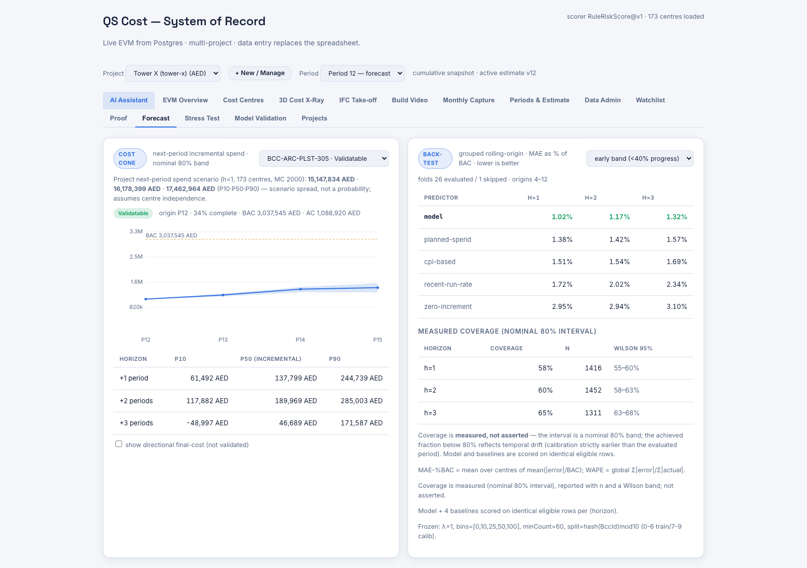

**On Tower X**

`BCC-ARC-PLST-305` at origin period 12 is 34% complete, 3,037,545 AED of budget with
1,088,920 AED spent, and badged **Validatable**. Its next-period spend forecast is
**137,799 AED**, with a P10–P90 band of **61,492 to 244,739 AED**. At project level the
next-period scenario is **15.1M / 16.2M / 17.5M AED** across 173 centres — labelled a scenario
spread, not a probability, because it assumes the centres are independent.

The back-test, over 26 evaluated folds and origins 4–12, in the early band (centres under 40%
complete), as mean absolute error expressed as a percentage of BAC — lower is better:

| Predictor | h=1 | h=2 | h=3 |
|---|---|---|---|
| **Model** | **1.02%** | **1.17%** | **1.32%** |
| Planned spend | 1.38% | 1.42% | 1.57% |
| CPI-based | 1.51% | 1.54% | 1.69% |
| Recent run rate | 1.72% | 2.02% | 2.34% |
| Zero increment | 2.95% | 2.94% | 3.10% |

The model beats all four baselines at every horizon in that band.

**And the band is honest about itself.** Measured coverage of the nominal 80% interval:
**58% at h=1** (n=1,416, Wilson 95% interval 55–60%), 60% at h=2, 65% at h=3. The application
states plainly that the achieved fraction sits below the nominal 80%, and why: the calibration
data is strictly earlier than the period being evaluated, so temporal drift eats into it. That
number is **measured and reported, never asserted**.

**API**

| Endpoint | Purpose |
|---|---|
| `GET /api/v1/forecast/cost-centres` | Next-period forecast for every centre, with trust badge. |
| `GET /api/v1/forecast/cone?bcc={id}` | h=1..3 bands, the cumulative cone, and a directional final cost. |
| `GET /api/v1/forecast/rollup` | Project P10 / P50 / P90 spend scenario. |
| `GET /api/v1/forecast/backtest` | Grouped rolling-origin metrics against the four baselines. |

**What's validated, what isn't**

- **Incremental spend is validated.** It is back-tested against four baselines on identical
  rows, with measured interval coverage and a Wilson confidence band on that measurement.
- **Final cost is directional and clearly labelled.** The cone tab hides it behind a checkbox
  reading *"show directional final-cost (not validated)"*. With a median 13% progress and four
  completed centres, this dataset cannot validate a final-cost forecast, and the system does not
  pretend otherwise.
- **The 80% band is nominal, not achieved.** Achieved coverage is published with its sample size
  and confidence interval.
- The project roll-up assumes centre independence — stated on the screen, because correlated
  centres would make the true spread wider.

# 8 · Unit-Rate What-If Scenarios

**Look forward**

> *What happens to this centre if we renegotiate the rate?*

**Why a QS cares**

This is the commercial conversation. A subcontractor is running at 340 AED per unit against a
budget of 300. You are about to negotiate. The question is what a move to 310 is actually worth
on this cost centre by completion — before the meeting, not after it.

**How it works**

Deterministic arithmetic, not a model. The scenario holds the recent *physical* pace constant
and reprices the remaining work at a rate you supply:

- Remaining quantity = budget quantity − earned quantity
- Cost to complete = quantity before the switch × realised rate + quantity after × the new rate
- Final cost = actual cost to date + cost to complete, and `VAC = BAC − final cost`

Two reference rates are computed for context: the **planned rate** (`BAC ÷ budget quantity`) and
the **realised rate** (`AC ÷ earned quantity`) — the second is usually the uncomfortable one.

The result always echoes the assumption back, so the number can never be quoted without the
condition attached to it.

**What you see**

Asked through the Copilot in plain English — *"What if we renegotiate BCC-STR-CON-206 to 310 per
unit?"* — and answered with the planned rate, the realised rate, the resulting final cost and
the variance at completion.

**What's validated, what isn't**

- The arithmetic is exact and deterministic; run it twice and you get the same answer.
- **It is a counterfactual, not a forecast.** It assumes the physical pace holds and only the
  rate changes. It is not back-tested and does not claim to be — it answers "what would this be
  worth?", not "what will happen?".

# 9 · Correction Actions

**Look forward**

> *What could we do about this centre, and what would it be worth?*

**Why a QS cares**

The drawer that tells you a centre is drifting should not stop there. This panel proposes
concrete corrective actions and shows what each would do to the spend curve over three periods.

**How it works**

The important design decision is **where the arithmetic happens**. The AI suggests actions and
supplies exactly one number per action: an **over-run reduction percentage**. Every dirham on
the chart is then computed in the front end, from the *validated* P50 spend increments of
*Feature 7*, applied through a fixed ramp — 50% of the effect in the first period, 85% in the
second, full effect in the third, because no corrective action lands instantly.

The chart plots the corrected trajectory against a "no action" baseline.

**What you see**

The **Correction actions** panel inside the cost-centre detail drawer, with a three-period
what-if chart.

**What's validated, what isn't**

- **The money is not model-generated.** It is the validated forecaster's own numbers with a
  declared ramp applied. The model contributes a judgement about effectiveness, not a figure.
- **The effectiveness estimate is a judgement.** The reduction percentage is the AI's opinion
  about how much a given action would help — informed, not measured. The ramp is a stated
  assumption, not a fitted curve.

# 10 · Estimate Assumption Stress Test

**Before you award**

> *Which assumptions in this estimate look aggressive — before we commit to them?*

**Why a QS cares**

Every feature so far needs actuals. This one runs at day zero, on the estimate alone, and asks
where the estimate is quietly optimistic. A thin unit rate or a heroic productivity assumption
becomes an over-run six months later; the cheapest time to argue about it is before award.

**How it works**

The engine produces **three output classes that are never fused into one score** — because they
have completely different evidential status, and merging them would launder an assumption into
a finding.

**Class 1 — reconciliation tie-out.** Rebuild should-cost bottom-up from norms × rates and
confirm it ties out to the bill: resource quantity is
`BOQ quantity × quantity per unit of work ÷ Output Norm` (that divisor again), resource cost is
`quantity × unit rate`, direct plus indirect ties to the BOQ, and the contract uplift equals
margin plus contingency. Tolerances are frozen: 1e-6 relative on quantities, 0.01 AED per item,
1 AED on the project roll-up. **This is a correctness proof of the engine's arithmetic — not a
signal about the project.** If it fails, the engine is wrong.

**Class 2 — assumption flags.** Cohort-gated review prompts that **read zero actuals**:

| Flag | Compared against | Triggers when | Severity |
|---|---|---|---|
| Aggressive Output Norm | Same sub-trade and unit | Norm is at or above the cohort's 90th percentile | Medium |
| Thin unit rate | Same resource type, description and consumption unit | Rate is at or below the cohort's 10th percentile | Medium |
| Zero / thin contingency | All BOQ items | Contingency is 0% (high) or under 2 percentage points (medium) | High / Medium |

A cohort needs at least **5 members** before any comparison is made. Every flag cites the exact
driving line and BOQ item refs, so it can be checked in seconds.

**Class 3 — retrospective peer benchmark.** Compares an estimate's unit cost against what
*completed* cost centres actually achieved, leave-one-out, requiring at least 5 distinct peers.

**What you see**

The **Stress Test** tab, in three clearly separated sections with the reconciliation card first.

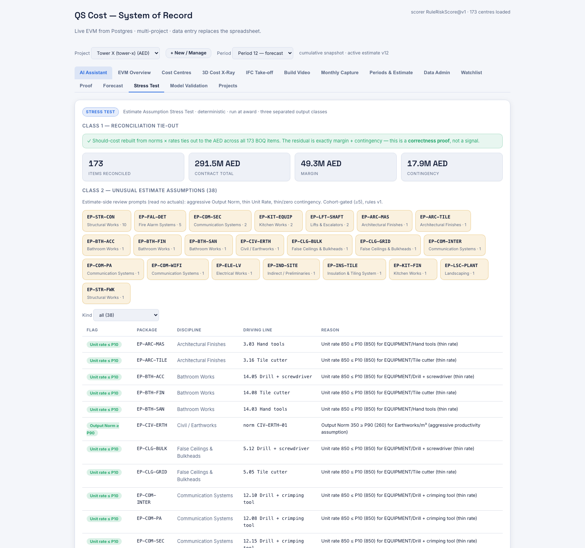

**On Tower X**

**Class 1 passes.** Should-cost rebuilt from norms × rates ties out to the dirham across all
**173 BOQ items**, and the residual is exactly margin plus contingency — **291.5M AED** contract
total, **49.3M AED** margin, **17.9M AED** contingency.

**Class 2 raises 38 flags** across the estimate packages, concentrated in `EP-STR-CON`
(structural concrete, 10 flags) and `EP-FAL-DET` (fire alarm systems, 5). Most are thin-rate
prompts — for example an equipment line at 850 AED sitting on the 10th percentile of its cohort
for hand tools, tile cutters and drills. These are review prompts, not verdicts.

**Class 3 returns nothing, and that is the correct answer.** With a median centre at 13%
progress, Tower X has effectively no completed cost centres, so no package cell reaches the
5-peer minimum. The engine suppresses the whole class rather than benchmarking against two
peers and calling it evidence.

**API**

| Endpoint | Purpose |
|---|---|
| `GET /api/v1/stress-test/reconciliation` | Class 1 tie-out. |
| `GET /api/v1/stress-test/assumptions?discipline=` | Class 2 flags and package heat. |
| `GET /api/v1/stress-test/peer-benchmark` | Class 3 retrospective benchmark. |

**What's validated, what isn't**

- **Class 1 is a proof, asserted by the test suite on every build.** It is not a signal about
  the project's health.
- **Class 2 flags are review prompts, not verdicts.** They read no actuals — a test asserts the
  flags are byte-identical with and without the actuals panel, so they genuinely cannot be
  contaminated by hindsight.
- **Class 3 is retrospective and, on this single project, empty.** It is included because the
  mechanism is real and would fire on a portfolio; it is suppressed rather than faked here.
- The engine is deterministic — same estimate in, same flags out.

# 11 · QS Copilot

**Ask it in plain English**

> *Anything in this guide, asked as a question, answered with its working shown.*

**Why a QS cares**

Because the fastest interface for "which centres are drifting and why" is the sentence itself.
The Copilot is the front door to every other feature, and it opens on the live drift watchlist
rather than a blank box.

**How it works**

The governing rule is **"tools compute, the model narrates"**. The language model has no
database access and cannot do arithmetic on your project. It selects from **13 read-only tools**
that run the *same* C# analytics the dashboard uses, and then explains what came back.

| Tool | What it answers |
|---|---|
| `GetWatchlist` | Which GREEN centres are about to tip. |
| `GetCostCentreDetail` | Everything about one centre. |
| `ExplainDrift` | Why a centre is drifting. |
| `GetEvmSnapshot` | EVM for a centre and period. |
| `ProjectEvm` | Project-level EVM totals. |
| `ListCentresByProgress` | Centres ranked by planned versus actual progress. |
| `ForecastIncrementalSpend` | Validated next-period spend with its band. |
| `ScenarioForecast` | The unit-rate what-if of *Feature 8*. |
| `DirectionalEac` | Final cost — always returned flagged as unvalidated. |
| `ResourceSplit` | The four-way actual cost split. |
| `ExplainVariance` | The attribution bridge of *Feature 4*. |
| `StressFlagsForPackage` | Class 2 estimate flags for a package. |
| `LocateCostRisk` | Where in the building the risk is (*Feature 12*). |

Every answer carries a **sources block** naming the tools that were called and the rows they
read, so any figure can be traced back. Tenancy is resolved **before** the model runs: the
tools are constructed against an already-authorised project snapshot, so there is no path by
which a prompt can reach another tenant's data.

If no API key is configured the endpoint stays alive and returns a clear "not configured"
message rather than failing.

**What you see**

The **AI Assistant** tab — the default landing view. A chat, four suggested questions generated
from the *actual* top-risk centre this period, and a collapsible live drift watchlist beneath.

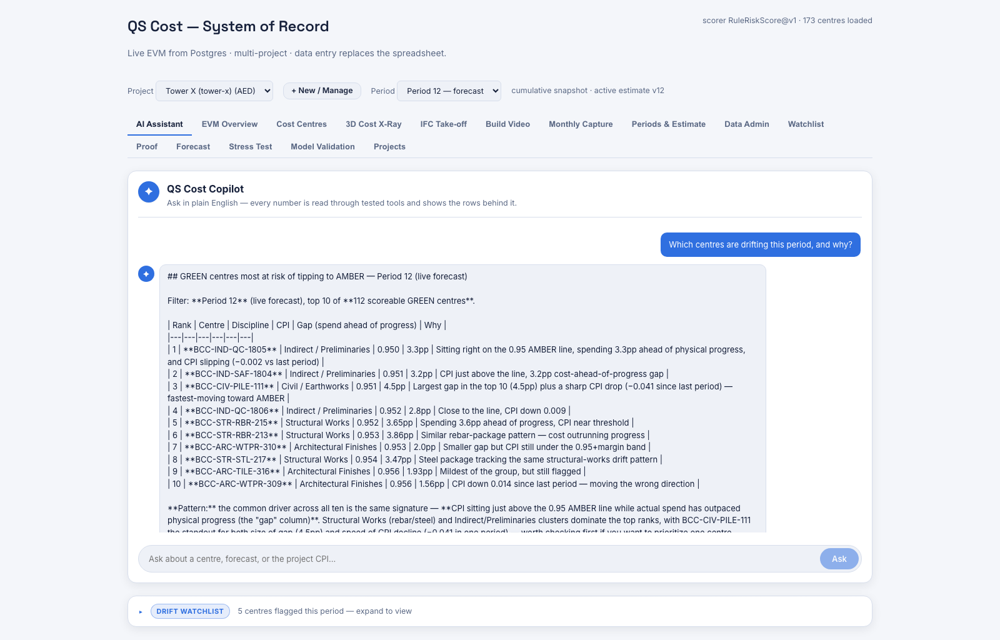

**On Tower X**

Asked *"Which centres are drifting this period, and why?"*, the Copilot calls the watchlist tool
and reports the ten highest-risk centres out of 112 eligible — CPI clustered between 0.950 and
0.956, every one spending ahead of its physical progress — then names the common driver and
singles out `BCC-CIV-PILE-111` as the riskiest, having both the largest spend/progress gap
(4.5pp) and the sharpest CPI drop (0.041 in a month).

Note what it did *not* do: the numbers in that answer are identical to the Watchlist tab,
because they came from the same tool.

**API**

| Endpoint | Purpose |
|---|---|
| `POST /api/v1/copilot/ask` | `{question, history}` → `{answer, refused, evidence[]}`. |

**What's validated, what isn't**

- **Grounded by construction.** No tool call, no number. The evidence block is the receipt.
- **Validated-versus-directional is enforced in the tools, not the prompt.** `DirectionalEac`
  returns its unvalidated flag as part of the payload, so the model cannot present a final-cost
  figure as validated even if asked to.
- **Tested independently.** 21 offline evaluation tests check tool routing and answer content
  against ground truth computed separately from the agent, plus an opt-in live routing
  evaluation.
- The model's *prose* is generated. The figures inside it are not.

# 12 · 3D Cost X-Ray

**On the building**

> *Where in the building is the money, and where is it drifting?*

**Why a QS cares**

A watchlist is a list of codes. `BCC-STR-FWK-209` means something to the person who wrote it and
nothing to the person who has to walk the site. Painting cost performance onto the building
turns a spreadsheet row into a place you can stand.

**How it works**

The massing is **derived from the bill**, not modelled by hand: floor count, footprint, storey
height, basement depth and core size are each read from priced BOQ lines, matching on item
reference first and falling back to description keywords. Every dimension carries the item
reference it came from and the derivation used — and where two lines imply different values,
the conflict is *reported*, not averaged away.

Each of the 10 zones is then coloured by its aggregated cost performance. Three rules keep the
picture honest:

- Zone CPI is `Σ EV ÷ Σ AC` — never the mean of the member centres' CPIs.
- A zone must carry at least **1% of its own BAC in actual cost** before any CPI is quoted;
  below that it is shown as *too early to judge* rather than given a meaningless ratio.
- Cost centres that cannot be located in the model are reported as an **explicit unmapped
  residual**, so that zones plus unmapped always ties back to the project BAC.

Clicking a zone opens the cost-centre drawer. A period scrubber replays the colouring month by
month.

**What you see**

The **3D Cost X-Ray** tab: the painted massing, a paint-mode switch (cost performance versus
unspent exposure), a legend, a provenance panel showing the BOQ line behind every derived
dimension, and a zone table.

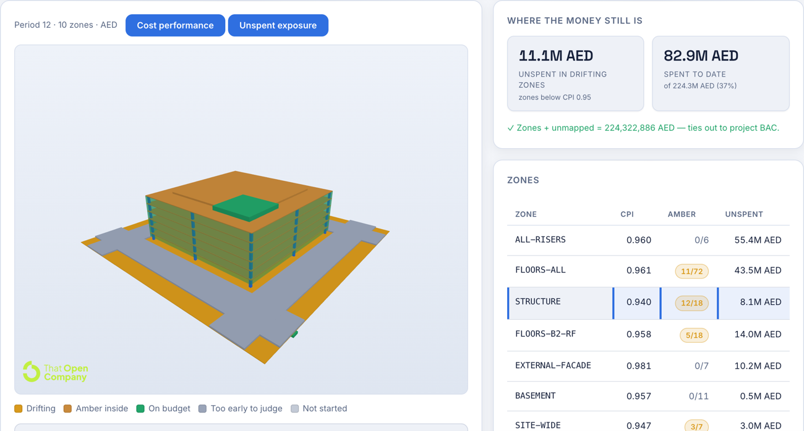

**On Tower X**

At period 12, across 10 zones: **11.1M AED still unspent in zones below CPI 0.95**, against
82.9M AED spent of a 224.3M budget. The tie-out line states it plainly —
*zones + unmapped = 224,322,886 AED, ties out to project BAC*.

The worst zone is `STRUCTURE` at CPI **0.940** with **12 of 18** centres AMBER and 8.1M AED
still to spend. `FLOORS-ALL` looks healthier at 0.961 but has 11 of 72 centres AMBER and
**43.5M AED** unspent — the larger exposure by far. That contrast is the argument for the
feature: the zone with the worst ratio is not the zone with the most money left to lose.

**API**

| Endpoint | Purpose |
|---|---|
| `GET /api/v1/model/cost-map?period={p}` | Per-zone BAC / PV / EV / AC / unspent / CPI / alert, plus the unmapped residual. |
| `GET /api/v1/model/geometry-spec` | The BOQ-derived massing with per-dimension provenance. |

**What's validated, what isn't**

- **The money is real and ties out.** Zone totals plus the unmapped residual equal project BAC,
  exactly.
- **The geometry is derived, and its derivation is on screen.** Where a fallback was used the
  spec is marked as not fully derived rather than presented as fact.
- **The massing is a schematic, not the building.** It is a block model inferred from bill
  quantities — enough to place cost, not a design deliverable.

# 13 · IFC Take-off

**On the building**

> *What would this model cost at our rates?*

**Why a QS cares**

Given an IFC model, the system measures what it can, prices it with the project's own rate
library, and — crucially — tells you what it *could not* price and why. The unpriced residual is
the interesting part: it is scope the estimate never carried. The pipeline is model-agnostic —
nothing in it knows which building it was handed — though the tab ships one bundled sample rather
than a file picker.

**How it works**

Four steps, each of which reports its own failures.

**Measure.** Volume and area are read from the model's property sets. The bundled sample has
**no `IfcElementQuantity` at all** and uses Spanish parameter group names, so the reader carries
a multi-locale synonym table — and reports whether standard base quantities were available or
whether it had to fall back.

**Price.** Four declared rules map an IFC class and a measure to a BOQ item and its rate, with a
unit-agreement guard so a cubic-metre rate can never be applied to a square-metre quantity.
Deliberate gaps — beams, reinforcing bar — are left unpriced and land in a visible residual.

**Reconcile.** The tie-out is
`priced + unpriced + unmeasured = total elements`, counted independently of the pricing pass.

**Compare to the bill.** Model quantities are grouped by BOQ item and compared against the
bill's own quantities: `variance = model quantity − BOQ quantity`, with a cost impact of
`variance × unit rate`. Where the bill carries no quantity, the item is reported as
*uncomparable* — never as a 100% overrun.

The rates used are **direct plus indirect only**; margin and contingency are excluded, because
this is a cost take-off, not a price.

**What you see**

The **IFC Take-off** tab: the loaded model, the rules table explaining every pairing, what could
be priced, what could not and why, the quantity variance against the bill, and the measurability
and locatability panels.

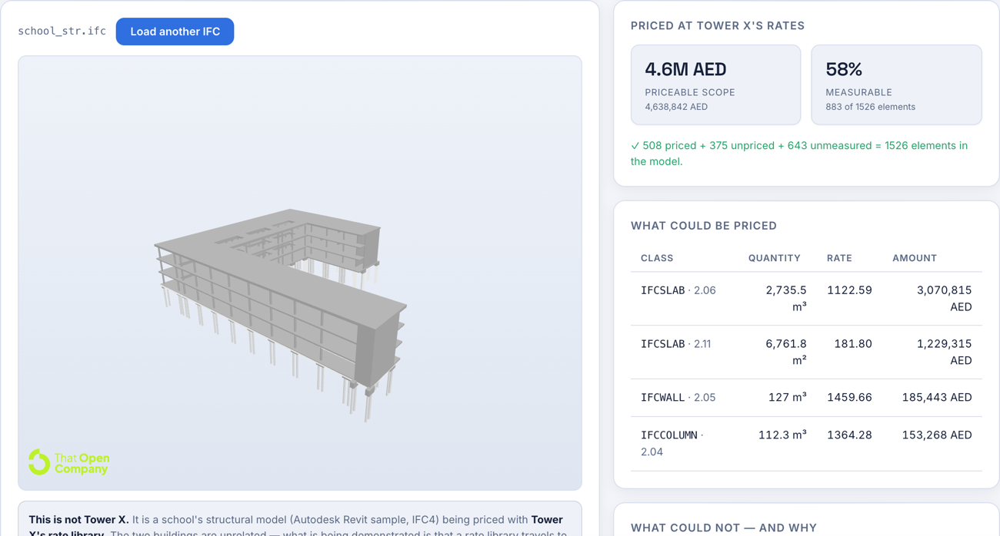

**On Tower X**

The bundled model is `school_str.ifc`, a genuine Autodesk Revit 2024 structural export of
**1,526 elements**. Priced with Tower X's rate library it comes to **4,638,842 AED** of
priceable scope, from **883 measurable elements (58%)**.

| Class → BOQ item | Quantity | Rate | Amount |
|---|---|---|---|
| IFCSLAB → 2.06 suspended slab concrete | 2,735.5 m³ | 1,122.59 | 3,070,815 AED |
| IFCSLAB → 2.11 slab soffit formwork | 6,761.8 m² | 181.80 | 1,229,315 AED |
| IFCWALL → 2.05 structural wall concrete | 127 m³ | 1,459.66 | 185,443 AED |
| IFCCOLUMN → 2.04 column concrete C40/50 | 112.3 m³ | 1,364.28 | 153,268 AED |

And the reconciliation, stated on the page:
**508 priced + 375 unpriced + 643 unmeasured = 1,526 elements**.

**API**

| Endpoint | Purpose |
|---|---|
| `POST /api/v1/model/price-takeoff` | Prices measured lines with the project rate book (max 500 lines). |

**What's validated, what isn't**

- **The tie-out is asserted by tests** and the element count is derived independently of the
  pricing pass, so a pricing bug cannot hide behind a matching total.
- **The model is a school, not Tower X**, and the tab says so on the page. The two buildings are
  unrelated. What is being demonstrated is that a rate library travels to an arbitrary model —
  the AED figure is a mechanism demonstration, not a valuation of Tower X.
- **The unpriced residual is a feature.** 375 beams are unpriced because *the bill prices no
  beam concrete* — there is no beam item in any of the 18 sections. Pointing them at the nearest
  item would attach cost to scope the estimate never carried.

# 14 · IFC → BOQ Element Register

**On the building**

> *Click an element — what does the bill say about it?*

**Why a QS cares**

This closes the loop between geometry and commercial data. Select a column in the viewer and
see which BOQ items it consumes, at what rates, belonging to which cost centres — and those
centres' live earned value. From there the whole cost-centre drawer opens on a piece of
geometry.

**How it works**

The two datasets share **no key**. Not one of the model's 1,526 elements carries a cost code —
there is no cost property set and no BOQ reference — and the bill carries no IFC identifier.
So the binding is **declared once, in a CSV a QS can read and argue with**:
`data/ifc_boq_map.csv`, one row per element-and-BOQ-item pair.

That single declared hop buys the entire chain, because the *second* hop is already exact:
`9_HISTORICAL_DATA.WBS_Code` **is** the BOQ item reference — 173 against 173, intersection 173,
zero orphans, asserted by a test. One authored arrow, and everything downstream of the BOQ item
is real project data.

Two rules keep an element's status honest: **an element's confidence is its weakest binding**,
and **an element's alert is its worst cost centre**. A slab whose concrete is on budget and whose
formwork is drifting is painted as drifting — averaging would hide it.

The register is regenerated by a dependency-free Python script and is **hand-editable by
design**: a QS who disagrees that a column's formwork belongs to item 2.09 can change that row,
and the join-integrity tests will fail the build if the edit points at a BOQ item that does not
exist or reaches no cost centre.

**What you see**

A **"Selected element → In the bill"** panel in the IFC Take-off tab, plus a confidence tier
breakdown answering *"could this model be located in the cost plan?"*.

**On Tower X**

**1,127 of 1,526 elements (74%)** are mapped, in **1,635 rows**, reaching **8 cost centres**.

| IFC class | BOQ item | Role | Elements | Confidence |
|---|---|---|---|---|
| IFCCOLUMN | 2.04 columns concrete / 2.09 column formwork | Concrete + formwork | 203 | 0.9 |
| IFCWALL | 2.05 wall concrete / 2.10 wall formwork | Concrete + formwork | 6 | 0.9 |
| IFCSLAB | 2.06 slab concrete / 2.11 soffit formwork | Concrete + formwork | 299 | 0.9 |
| IFCREINFORCINGBAR (sub level) | 2.12 rebar, raft foundations | Rebar | 560 | **0.6** |
| IFCREINFORCINGBAR (above ground) | 2.14 rebar, suspended slabs | Rebar | 59 | **0.6** |

The 399 unmapped elements are reported as a **scope gap, not a mapping failure**: 375 beams
(the bill prices no beam concrete), 22 members and 2 plates (no item in this bill covers the
class).

**API**

| Endpoint | Purpose |
|---|---|
| `GET /api/v1/model/element-map` | The element → BOQ register, joined to rates and cost centre ids. |

**What's validated, what isn't**

- **The second hop is exact and tested.** BOQ item references and WBS codes are the same set,
  one centre per item — verified against the committed CSV, not a fixture.
- **The first hop is declared, and its weakest links are marked.** Rebar placement is carried at
  **confidence 0.6** and rendered at reduced opacity, because the file contains no host
  relationship: `IFCRELASSIGNSTOPRODUCT` and `IFCRELNESTS` both have zero occurrences, so storey
  is the only signal available. Rebar to columns and walls is *never* assigned, because nothing
  in the file could justify it.
- **Formwork rows are inferred, not measured.** A concrete element implies its formwork item;
  the register does not independently measure formwork area.
- The register binds one specific model to one specific project. Load a different IFC and the
  tab falls back to zone-level placement.

# 15 · 4D Build Sequence

**On the building**

> *Play the build — with cost performance as the colour.*

**Why a QS cares**

Twelve periods of EVM is a table nobody reads twice. The same twelve periods as a building that
rises, colour-coded by which cost centres are drifting, is a thirty-second briefing that a
project director actually watches.

**How it works**

Once elements reach cost centres (*Feature 14*), the sheet's own progress curves can drive the
model. Pressing **▶ Build** plays periods 1 → 12: the structure rises according to each cost
centre's `Actual_Pct_Complete`, and every element is coloured by that centre's alert level.

The video is **rendered, not screen-recorded**. The application exposes a small purpose-built
surface at `/?render=1` whose only job is to draw the model and its caption at a fixed size and
resolve when a requested frame is genuinely on screen. The renderer requests each frame, waits
for the model to report it has finished redrawing, and captures. Nothing is paced by a wall
clock — so **the same data renders byte-identical frames every time**, verified by rendering
twice and diffing the frame checksums. Renaming a button in the product cannot silently break
the video.

**What you see**

The **▶ Build** control on the IFC Take-off tab, and the rendered file
`presentation/tower-4d-build.mp4` — 8 seconds, 1600×900, 240 frames at 30fps.

**On Tower X**

**What comes from the data:** the pace (real S-curves, 0% at period 1 rising to 66–77% by period
12, per cost centre); the colour (each element carries its own centre's alert — GREEN elements
appear among the AMBER around period 8 because those centres genuinely recovered that month);
and what never gets built (the 375 unpriced beams stay grey ghosts for the whole run, so the
scope gap is visible as structure that never fills in).

**What is assumed:** which elements are built, and in what order. `Actual_Pct_Complete` is per
cost centre, never per element — a centre at 43% says nothing about *which* 43% of its 299 slabs
are poured. So the sequence orders elements bottom-up by storey, then by identifier for a stable
tie-break, and reveals the first *n* once the centre reaches *n ÷ total*. That is what every 4D
planning tool does, and it is defensible for a concrete frame — but it is a sequence that was
chosen, and the caption says so on every frame: **"The order is assumed, the amounts are not."**

**What's validated, what isn't**

- **Determinism is a contract, not an aspiration** — asserted by re-rendering and diffing.
- **The amounts and the colours are the workbook's.** The order is a declared assumption,
  captioned on every frame.
- An element appears as soon as *any* of its cost centres reaches it, and shows the *worst*
  alert among them — both chosen so the animation cannot hide trouble.

# 16 · Reporting Workflow

**Run it as a system**

> *How do we open and close periods, and capture progress and cost?*

**Why a QS cares**

This is what makes the system a system of record rather than a viewer. Data comes in through a
controlled monthly cycle, with a snapshot taken at period open and validation at period close.

**How it works**

Opening a period snapshots the budget and planned percentages, so the baseline for that month is
fixed at the moment it starts. During the month, progress is captured per cost centre and cost
is posted as **idempotent deltas to a ledger** — posting the same delta twice does not double
it. Closing a period runs validation and returns a **typed list of failures** rather than a
generic error, so you know exactly which centre blocked the close.

Estimate versions are published and activated explicitly, so you always know which estimate the
current numbers are measured against. A one-time **cutover** switches the project from
cumulative snapshot mode to ledger mode; after cutover, actual cost is derived from the ledger.
Rebaselining an open period is supported and controlled.

All of these run as database stored procedures with immutability triggers, so the guarantees
hold even against direct database access.

**What you see**

**Periods & Estimate** — the period table with open/close actions and the publish control.
**Monthly Capture** — the progress and cost entry forms.

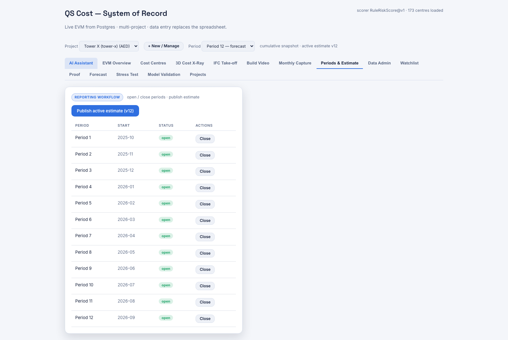

**API**

| Endpoint | Purpose |
|---|---|
| `GET /api/v1/periods` | Reporting periods and their status. |
| `POST /api/v1/periods/{n}/open` · `/close` · `/rebaseline` | Period lifecycle. |
| `POST /api/v1/capture/progress` · `/capture/cost` | Monthly capture. |
| `POST /api/v1/estimate-versions/{id}/publish` | Publish and activate an estimate version. |
| `POST /api/v1/cutover` | One-time cumulative → ledger cutover. |

**What's validated, what isn't**

- Cost posting is idempotent, and the close is validated with typed, actionable failures.
- The lifecycle rules are enforced in the database, not only in the API.

# 17 · Project Management

**Run it as a system**

> *Create, import, switch, rename and delete projects.*

**Why a QS cares**

Tower X is one project. The system is multi-project by construction, and a new project can be
stood up from a workbook in one upload — which is also how you would onboard a second real
project.

**How it works**

Create an empty project, or upload an `.xlsx` and have it imported: sheets 1–4 and 9 are read,
mapped and persisted, and the import returns a **reconciliation summary** so you can see
immediately whether the workbook tied out. An existing project can be re-imported, renamed, have
its reporting currency changed, or be deleted. You only see projects you are a member of.

**What you see**

The **Projects** tab: create-or-import, a table of projects with slug, currency, active estimate
version and status, and rename/delete actions.

**API**

| Endpoint | Purpose |
|---|---|
| `GET /api/v1/projects` | Projects you are a member of. |
| `POST /api/v1/projects` · `/projects/import` | Create empty, or create from an uploaded workbook. |
| `POST /api/v1/projects/{slug}/import` | Re-import a workbook. |
| `PATCH` · `DELETE /api/v1/projects/{slug}` | Rename / change currency / delete. |

**What's validated, what isn't**

- The importer has a parity mode that verifies what it loaded against the source workbook, and
  contract tests assert the expected shape — 2,076 panel rows and 173 cost centres for Tower X.
- Import reconciliation is surfaced to the user rather than logged and forgotten.

# 18 · Data Administration

**Run it as a system**

> *Edit the underlying data, safely, without a database client.*

**Why a QS cares**

Real data has errors. Somebody has to be able to fix a wrong unit rate or a mistyped quantity
without raising a ticket — but not by opening a SQL client against production.

**How it works**

The server publishes an **entity registry**: 13 entities, grouped the way the source workbook is
grouped, each column carrying metadata for whether it is insertable, updatable, required, a
foreign key or an enumeration. The user interface is generated from that registry — the forms
and tables are not hand-written per table, so the screen cannot drift out of step with what the
server will actually accept.

**What you see**

The **Data Admin** tab, organised by workbook sheet — Bill of Quantities, Estimate Norms, BOQ
Mapping, Estimate Datasheet, Cost Centres & Budget, Periods & Actuals, System & Import — with
generated browse, add, edit and delete.

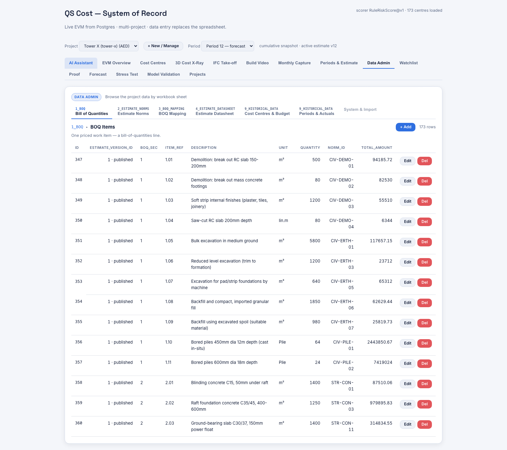

**API**

| Endpoint | Purpose |
|---|---|
| `GET /api/v1/entities` | The registry: entities, columns and capabilities. |
| `GET` · `POST` · `PUT` · `DELETE /api/v1/entities/{key}[/{id}]` | Governed CRUD. |

**What's validated, what isn't**

- Writes are constrained by the registry's declared capabilities, and go through the same
  row-level security as every other read and write.
- The registry endpoint itself is static metadata and is deliberately global.

# 19 · Multi-Tenant Security

**Run it as a system**

> *How is each project's data kept separate?*

**Why a QS cares**

The moment there is more than one project — or more than one client — "who can see what" stops
being a detail.

**How it works**

Isolation is enforced by **PostgreSQL row-level security**, not by application `WHERE` clauses.
Every tenant table has forced RLS with a non-recursive membership function, and reads go through
a `security_invoker` view, so the database itself refuses to return another tenant's rows even if
the application asks for them. Each request resolves its tenant context before any handler runs,
and an authorisation probe runs before project data is touched — including before the Copilot's
tools are constructed.

Three endpoints are **deliberately global**: `/health` and `/validation-summary` report the
process's own startup model, and the `/entities` registry is static metadata. Everything that
reads project data is authorised first.

**What's validated, what isn't**

- **The authorisation half is real and enforced in the database.** Dedicated SQL test suites and
  containerised database tests run the isolation guarantees on every build.
- **The authentication half is a development shim.** Identity arrives as an `X-User-Id` header;
  there is no OIDC, token validation or session management. That is a deliberate scope decision
  for a prototype — the isolation model behind it is production-shaped, the front door is not.

# The honesty ledger

Every claim in this system that is directional, assumed or otherwise not fully validated, in one
place. Each of these is also stated on the screen where it appears.

| # | Claim | Status | Why |
|---|---|---|---|
| 1 | Final cost / EAC / VAC | **Directional, not validated** | Median centre progress is 13% and effectively nothing has completed — there is no final-cost ground truth to back-test against. Hidden behind an explicit "not validated" toggle in the UI. |
| 2 | The 80% forecast band | **Nominal, achieved coverage published** | Measured at 58% / 60% / 65% for h=1/2/3, with sample sizes and Wilson intervals. Below nominal because calibration data is strictly earlier than the evaluated period. |
| 3 | Project spend roll-up | **Assumes centre independence** | Stated on screen. Correlated centres would widen the true spread. |
| 4 | Variance attribution | **Assumption-based** | Earned value is split by the *estimate's* resource shares, not measured actuals. Badged in the UI, with the evidence needed named. A hypothesis to confirm, not a proven cause. |
| 5 | Correction action effectiveness | **A judgement, with declared ramp** | The AI supplies a reduction percentage; all money is computed from the validated forecast through a fixed 50/85/100% ramp. |
| 6 | Class 3 estimate benchmark | **Retrospective, and empty here** | Requires ≥5 completed peers. No Tower X cell qualifies, so the class is suppressed rather than computed on thin evidence. |
| 7 | Watchlist accuracy | **Single project, 117 transitions** | precision@5 of 45% with a per-fold range of 20–80%. Enough to compare rules, not enough to claim a benchmark. |
| 8 | Peer / spatial drift signals | **Descriptive only, never deployed** | The peer blend weight is predeclared, not fitted. Zone is a proxy for discipline on this project, so the spatial question could not be asked at all. |
| 9 | The IFC model | **A school, not Tower X** | The two buildings are unrelated. The mechanism is real; the take-off total is a demonstration, not a valuation. |
| 10 | IFC rebar placement | **Confidence 0.6** | The file carries no host relationship, so storey is the only available signal. Rendered at reduced opacity; rebar to columns and walls is never assigned. |
| 11 | IFC formwork rows | **Inferred, not measured** | A concrete element implies its formwork item; the area is not independently measured. |
| 12 | 4D build order | **A declared assumption** | Progress is per cost centre, never per element. Ordered bottom-up by storey; captioned on every frame. |
| 13 | Authentication | **A development shim** | Identity is an `X-User-Id` header. The *authorisation* half — Postgres row-level security — is real and tested. |
| 14 | 3D massing | **Derived schematic** | Inferred from bill quantities, with per-dimension provenance shown. Not a design model. |
| 15 | Projected build, periods 13–15 | **Back-tested, ±1.9 / 3.2 / 3.9 pp** | Recent-pace progress projection, scored by rolling origin against three alternatives on 1,384 / 1,211 / 1,038 rows. The band is the measured residual spread, not a nominal one. Drawn translucent so a projected element never reads as a built one. |
| 16 | Projected build, periods 16+ | **Extrapolation, no error bar earned** | Same arithmetic, but twelve reported periods cannot score a horizon this far out. The band is scaled by √(h/3) rather than measured. Tiered separately in the UI, on the slider, the badge and the geometry. |
| 17 | Projected completion dates | **A pace, not a date** | "Tops out around period 21" assumes the last three periods' pace continues. 26 of 173 centres have no pace at all and are given no finish period rather than a distant one. |

Three things the system consistently refuses to do, which is why the list above is short:
it never averages a ratio when it can aggregate the money and divide once; it never hides a
reconciliation residual inside a category; and it never fills a gap with an invented number.

# API reference

39 endpoints across 13 controllers. Base URL in development is `http://localhost:5070`.

| Method | Path | Purpose |
|---|---|---|
| GET | `/api/v1/health` | Process and model health. **Global.** |
| GET | `/api/v1/validation-summary` | Frozen model-level back-test. **Global.** |
| GET | `/api/v1/overview` | Project EVM totals plus trend. |
| GET | `/api/v1/cost-centres` | Per-centre computed EVM. |
| GET | `/api/v1/watchlist` | Ranked at-risk GREEN centres. |
| GET | `/api/v1/watchlist/backtest` | Hindsight-graded watchlist. |
| GET | `/api/v1/forecast/cost-centres` | h=1 spend forecast for all centres. |
| GET | `/api/v1/forecast/cone` | h=1..3 bands plus cumulative cone. |
| GET | `/api/v1/forecast/rollup` | Project P10/P50/P90 spend scenario. |
| GET | `/api/v1/forecast/backtest` | Rolling-origin metrics against four baselines. |
| GET | `/api/v1/forecast/progress` | Projected physical percent complete past the last reported period, with tiers and bands. |
| GET | `/api/v1/stress-test/reconciliation` | Class 1 tie-out. |
| GET | `/api/v1/stress-test/assumptions` | Class 2 flags and package heat. |
| GET | `/api/v1/stress-test/peer-benchmark` | Class 3 retrospective benchmark. |
| GET | `/api/v1/variance` | CV attribution, SV lane and tie-out. |
| POST | `/api/v1/copilot/ask` | Agent question and answer with evidence. |
| GET | `/api/v1/model/cost-map` | Per-zone cost performance plus unmapped residual. |
| GET | `/api/v1/model/geometry-spec` | BOQ-derived massing with provenance. |
| GET | `/api/v1/model/element-map` | IFC element → BOQ register. |
| POST | `/api/v1/model/price-takeoff` | Price measured take-off lines. |
| GET/POST/PATCH/DELETE | `/api/v1/projects…` | Project list, create, import, re-import, rename, delete (6 endpoints). |
| GET/POST | `/api/v1/periods…`, `/capture/…`, `/estimate-versions/{id}/publish`, `/cutover` | Reporting workflow (8 endpoints). |
| GET/POST/PUT/DELETE | `/api/v1/entities…` | Registry and governed CRUD (6 endpoints). |

Errors follow a consistent convention: `401` no identity, `403` not a member of the project,
`404` unknown project or missing artifact, `400` malformed parameters.

# Under the hood

## Stack

| Layer | Technology |
|---|---|
| API | ASP.NET Core 8 · C# · 5 projects (Domain, Infrastructure, Core, Agent, Web.API) |
| Database | PostgreSQL 15+ · raw SQL schema, 10 migrations · forced row-level security · `security_invoker` views · stored procedures for the workflow |
| Front end | React 18 · TypeScript 5.6 · Vite 5.4 · hand-built SVG charts (no chart library) |
| 3D | three.js · web-ifc · That Open Company components |
| Workbook | ClosedXML |
| AI | Microsoft Agent Framework over Claude Sonnet — 13 read-only tools, 2,048 max output tokens |

**No machine-learning dependency.** Ridge regression, the Cholesky solve, conformal prediction
intervals and quantile computation are hand-written in C#. There is no Python at build time or
run time; the Python that exists (`tools/ifc_boq_map/generate_map.py`) is a one-off generator
using only the standard library.

## Test coverage

| Suite | Scope |
|---|---|
| ~140 xUnit facts across 20 files | Analytics, pricing, tie-outs, copilot tool scope, 21 offline copilot evaluations |
| 2 containerised database gates | Real PostgreSQL 17, schema and isolation contracts |
| 5 SQL test suites | Contracts, ledger, authoring, portfolio, seed |
| 23 Vitest tests | The 3D model modules and the build sequence |

The tests that matter most are the ones that assert an *identity* rather than a value: the
estimate reconciliation to the dirham, the variance tie-out, the take-off element count, and the
byte-identical video render. Those are the ones that fail loudly if a change quietly breaks the
arithmetic.

# Running it yourself

Prerequisites: .NET 8, Node 20+, PostgreSQL 15+.

**1. Prepare the database** — apply the schema and import the workbook:

`QsEarlyWarning/db/apply.sh qs_phase1`, then
`dotnet run --project QsEarlyWarning/tools/QsEarlyWarning.Importer -c Release`

**2. Start the API** on port 5070:

`ASPNETCORE_ENVIRONMENT=Development dotnet run --project QsEarlyWarning/src/QsEarlyWarning.Web.API -c Release --urls http://localhost:5070`

**3. Start the dashboard** on port 5173:

`cd QsEarlyWarning/frontend/qs-early-warning && API_URL=http://localhost:5070 npm run dev`

Then open `http://localhost:5173`. The `/run_system` command in this repository does all three
and prints the URLs.

The Copilot needs an Anthropic API key (`ANTHROPIC_API_KEY` or the `Copilot:AnthropicApiKey`
setting). Without one, every other feature works normally and the Copilot endpoint returns a
clear "not configured" message.

To regenerate the 4D video with both servers running:
`node tools/render_build_video/render.mjs` — 240 frames at 30fps, about a minute.

---

## Where to read more

The engineering detail behind five of these features — the departures from spec, the maths
walkthroughs, the leakage discipline, and the reviews that shaped them — is in the repository's
`docs/` folder: `12-idea-1-implementation.md` through `16-idea-5-implementation.md`. The BIM
work has its own set: `17-ifc-boq-element-map.md`, `21-3d-cost-xray.md`, `22-ifc-takeoff.md` and
`23-4d-build-sequence.md`. The data itself is documented in `DATA_DICTIONARY.md` and
`data/README.md`.

This guide is generated from `docs/QS-Cost-Feature-Guide.md`. To rebuild it after an edit —
including re-embedding the screenshots — run `python3 tools/build_feature_pdf.py`.
